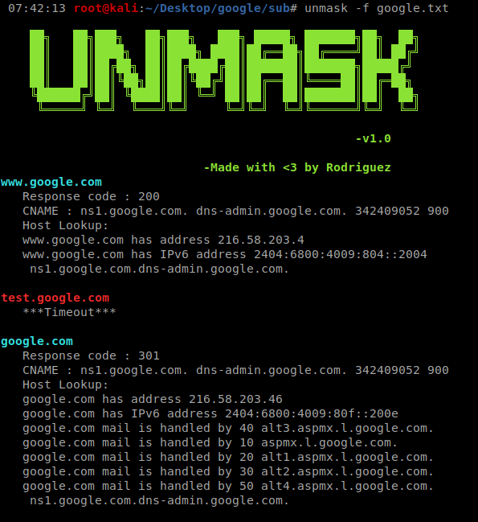

# Unmask
A simple tool made from Bash for initial RECON purpose, to find the website's status and helps to look for Subdomain Takeover.

# Note
Add the unmask shell script to PATH variable for easy usage.

# Usage
```
unmask -f <filename>
   -f - File containing list of domain names.
```
    
    

    
    
